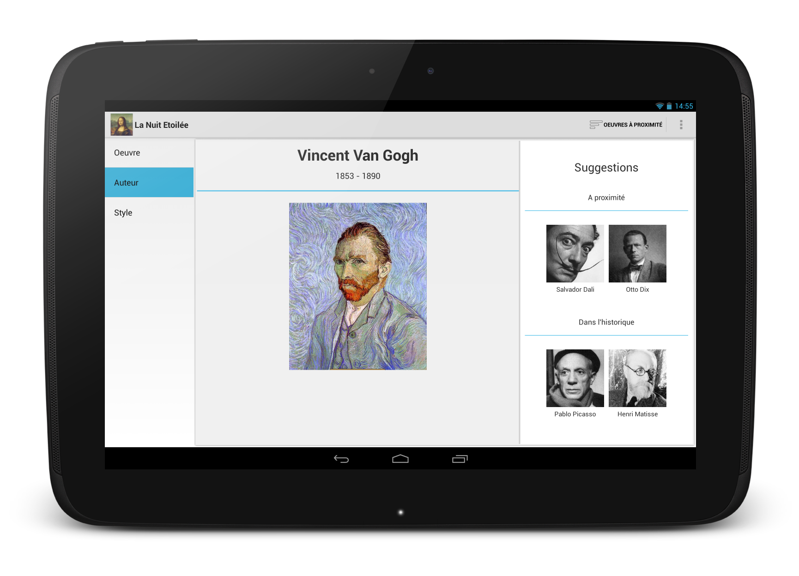

Museum 
======

Museum is an Android app that helps you visit museums and cultural sighs by providing interesting content based on
your position, on your profile, on your history and on your cultural background.

Its UI is tablet-optimized and respects Google's guidelines regarding both user interface and experience.

It was developed within the [CALM Project](https://sites.google.com/site/calmprojectutc/) (ContextuAlized Learning through Mobility),
which is aimed at using innovative technologies in order to improve museums attractiveness and modernize access to culture.
By the end of the project, discussions were ongoing with Le Louvre to implement such a project in the museum.
